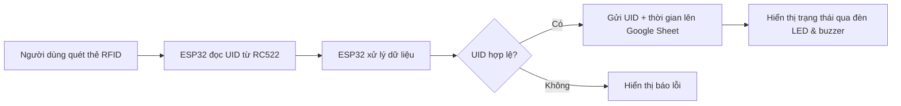

# 🗳️ HỆ THỐNG BỎ PHIẾU TỰ ĐỘNG BẰNG THẺ RFID SỬ DỤNG ESP32

## 📌 1. Giới thiệu chung

Dự án xây dựng một **hệ thống bỏ phiếu điện tử** ứng dụng công nghệ RFID để xác thực người tham gia và tự động gửi dữ liệu lên Google Sheet. Hệ thống hướng tới tính **chính xác**, **tiện lợi**, và **minh bạch**, phù hợp với quy mô lớp học, nhóm nhỏ hoặc các hoạt động tổ chức nội bộ.

Người dùng sử dụng thẻ RFID để thực hiện bỏ phiếu. Hệ thống sẽ ghi nhận **UID**, **thời gian**, và hiển thị trạng thái qua đèn LED và buzzer.

---

## 📊 2. Sơ đồ hệ thống và các chức năng

### 🛠️ **Sơ đồ hoạt động:**



### ✅ **Chức năng chính:**
- Nhận dạng thẻ RFID (UID)
- Xác thực dữ liệu đầu vào
- Gửi thông tin lên Google Sheet thông qua API
- Phản hồi bằng đèn LED và buzzer
- Ghi nhận thời gian bỏ phiếu chính xác
- Hiển thị bảng kết quả theo thời gian thực trên web

---

## 💡 3. Công nghệ và kỹ thuật sử dụng

- **Phần cứng:**
  - ESP32 DevKit V1
  - Module RFID RC522
  - Buzzer
  - Đèn LED
  - Breadboard + Dây jumper

- **Phần mềm:**
  - Arduino IDE
  - Web frontend (HTML + CSS + JS)
  - Google Sheet API (qua Google Apps Script)

- **Thư viện Arduino:**
  - `WiFi.h`
  - `HTTPClient.h`
  - `MFRC522.h`
  - `SPI.h`

- **Web frontend:**
  - `index.html`: Giao diện hiển thị bảng kết quả bỏ phiếu
  - `style.css`: Giao diện tối (dark mode) thân thiện với người dùng
  - Tìm kiếm UID hoặc thời gian theo thời gian thực
  - Dữ liệu lấy từ Google Sheet CSV công khai

---

## 🌐 4. Giao diện Web kết quả


> 🔗 **Xem kết quả tại:**  
> [📄 Google Sheet kết quả](https://docs.google.com/spreadsheets/d/1kIJKhrH2Hadh4dHaKfOFwnTnS3jCcrM927r02FP0Lyg/edit?gid=0#gid=0)

> 🌐 **Giao diện Web:**  
> - `index.html` + `style.css` tải dữ liệu từ Google Sheet
> - Tự động cập nhật bảng kết quả sau khi có người bỏ phiếu
> - Tính năng lọc nhanh theo UID hoặc thời gian

---

## 🖼️ 5. Một số hình ảnh thực tế

| Mạch hoàn chỉnh | Giao diện Web |
|-----------------|----------------|
| ![Mạch RFID ESP32] | ![Giao diện web] | https://drive.google.com/drive/folders/1WjVYze99lb6qAEREcxU7bJAwUDns-Mh5?usp=drive_link

> *Lưu ý: Cập nhật link ảnh thực tế từ Google Drive hoặc Imgur để hiển thị đầy đủ.*

---

## ⚙️ 6. Cài đặt và triển khai

### A. Cài đặt phần cứng:
1. Nối các chân RC522 với ESP32 theo sơ đồ:
    - SDA → GPIO5  
    - SCK → GPIO18  
    - MOSI → GPIO23  
    - MISO → GPIO19  
    - RST → GPIO22  
    - GND → GND  
    - 3.3V → 3.3V  

2. Nối thêm đèn LED và buzzer (nếu có) theo code.

### B. Cài đặt phần mềm:
1. Mở file `code_esp32.ino` trong Arduino IDE.
2. Cài các thư viện cần thiết (SPI, MFRC522, WiFi).
3. Điền thông tin Wi-Fi vào code.
4. Tạo webhook Google Apps Script để nhận dữ liệu từ ESP32.
5. Tải code lên ESP32 và thử nghiệm.

---

## 📁 7. Cấu trúc thư mục

```
📦 RFID-Voting-System/
├── code_esp32.ino
├── index.html
├── style.css
└── README.md
```

---

## 👨‍💻 8. Liên hệ

- Tác giả: [người thực hiện: Giáp Thiên Thanh]
- Email: hoitamsonbg@gmail.com

